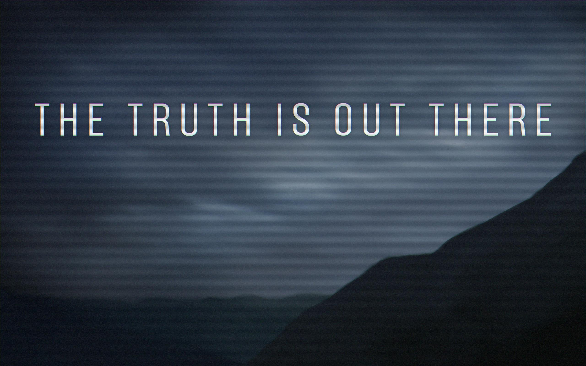

# 👩🏿‍💻 𝙱𝚎𝚌𝚘𝚖𝚎 𝚊 𝚑𝟺𝚡𝟶𝚛

<figure><figcaption></figcaption></figure>

## &#x20;<mark style="background-color:$success;">Cool Resources</mark>&#x20;

* [**Bitcoin: A Peer-to-Peer Electronic Cash System**](https://bitcoin.org/bitcoin.pdf)**​**
* **​**[**The Ethereum whitepaper**](https://ethereum.org/en/whitepaper/)
* [**The Hacker's Manifest**](http://phrack.org/issues/7/3.html#article)
* [**A Cypherpunk Manifest**](https://activism.net/cypherpunk/manifesto.html)
* [**The Crypto Anarchist Manifest**](https://nakamotoinstitute.org/crypto-anarchist-manifesto/)
* [**The Trustless Manifest**](https://trustlessness.eth.limo/general/2025/11/11/the-trustless-manifesto.html)
* [**The Electronic Frontier Foundation**](https://www.eff.org/)
* [**The Cypherpunk Symposium**](https://github.com/cypherpunk-symposium)
* [**Bitcoin Magazine**](https://www.youtube.com/@BitcoinMagazine)
* [**Protocol Town Hall**](https://www.youtube.com/@protocoltownhall)
* [**The Tor project**](https://www.torproject.org/)
* [**Web3Privacy Group**](https://web3privacy.info/)
* [**Bankless**](https://www.bankless.com/)
* [**What Bitcoin Did**](https://www.youtube.com/@WhatBitcoinDidPod)
* [**The Network State Podcast**](https://www.youtube.com/@nspodcast)
* [**Web3 and docs by ethereum.org**](https://ethereum.org/en/web3/)
* [**Intro to Stablecoins**](https://ethereum.org/en/stablecoins/)
* [**Understanding Stablecoins**](https://www.investopedia.com/terms/s/stablecoin.asp)**​**
* [**Finematics Videos**](https://www.youtube.com/c/Finematics)
* [**Introduction to Algorithms, by Thomas H. Corman**](https://www.amazon.com/Introduction-Algorithms-3rd-MIT-Press/dp/0262033844)
* [**The Algorithm Design Manual, by Steve S. Skiena**](https://www.amazon.com/Algorithm-Design-Manual-Steven-Skiena/dp/1849967202)
* [**The Art of Computer Programming, D. Knuth**](https://www.amazon.com/Art-Computer-Programming-Fascicle-Techniques/dp/0321580508/ref=sr_1_15?qid=1705073549\&refinements=p_27%3ADonald+E.+Knuth\&s=books\&sr=1-15)
* [**Understanding Cryptography, by Christof Paar**](https://github.com/lilith-security/COMPUTER-SCIENCE-REFS/blob/main/Understanding%20Cryptography%20by%20Christof%20Paar%20.pdf)
* [**Gödel, Escher, Bach, by Douglas Hofstadter**](https://en.wikipedia.org/wiki/G%C3%B6del,_Escher,_Bach)&#x20;
* [**A Graduate Course in Applied Cryptography**](http://toc.cryptobook.us/)
* [I**n the Beginning... Was the Command Line**](https://en.wikipedia.org/wiki/In_the_Beginning..._Was_the_Command_Line)
* **Flatland: A Romance of Many Dimensions**

<figure><figcaption></figcaption></figure>

***

## <mark style="background-color:yellow;">**🎖️ Contemporary Cypherpunks && H4x0rs🎖️**</mark>&#x20;

* [**Linus Torvalds**](https://www.youtube.com/watch?v=o8NPllzkFhE)
* [**Adam Back**](https://www.youtube.com/watch?v=QkSDdb7cAoM\&t=4s)
* [**Ross Ulbricht**](https://www.youtube.com/watch?v=8ZZGRA-8ZMU\&t=2s)
* [**Edward Snowden**](https://en.wikipedia.org/wiki/Edward_Snowden)
* [**Tobi Lütke**](https://en.wikipedia.org/wiki/Tobias_L%C3%BCtke)
* [**Jeff Moss**](https://en.wikipedia.org/wiki/Jeff_Moss_\(hacker\))
* [**Tay**](https://twitter.com/tayvano_)
* [J**ulian Assange**](https://en.wikipedia.org/wiki/Julian_Assange)
* [**Marc Andreeseen** ](https://en.wikipedia.org/wiki/Marc_Andreessen)
* [**Jame Lopp**](https://www.lopp.net/)
* [**Michael Saylor**](https://en.wikipedia.org/wiki/Michael_J._Saylor)
* [**Pavel Durov 🔥**](https://t.me/s/durov)
* [**Justin Sun**](https://en.wikipedia.org/wiki/Justin_Sun)
* [**Dwarkesh Patel**](https://www.youtube.com/@DwarkeshPatel/)
* [**Charles Hoskinson**](https://www.youtube.com/@charleshoskinsoncrypto)
* [**geohot**](https://en.wikipedia.org/wiki/George_Hotz)
* [**vub**](https://vitalik.eth.limo/)
* [**Milady**](https://www.youtube.com/watch?v=aW7lICIQqOk)
* [**Lynn Alden**](https://www.lynalden.com/)
* [**Dave Plummer**](https://www.youtube.com/@DavesGarage)
* [**Natalie Brunell**](https://www.youtube.com/@nataliebrunell)
* [**Jack Dorsey**](https://en.wikipedia.org/wiki/Jack_Dorsey)
* [**Patrick Wardle**](https://objective-see.org/about.html)
* [**bt3gl**](https://github.com/von-steinkirch)

