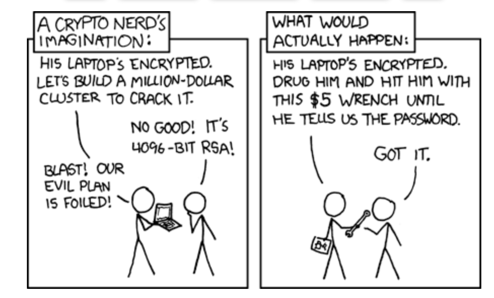

---
layout:
  width: default
  title:
    visible: true
  description:
    visible: true
  tableOfContents:
    visible: true
  outline:
    visible: true
  pagination:
    visible: true
  metadata:
    visible: true
---

# Black hat hacker

<figure><figcaption></figcaption></figure>

### <mark style="color:purple;">Black hat hackers are players who break into computer systems and networks without authorization.</mark>&#x20;

### <mark style="color:green;">Black hats are motivated by self-serving reasons, such as financial gain, revenge, or simply to spread chaos.</mark>&#x20;

> 💀 **The weakest link is the human link. The easiest hack is the social engineering hack. Physical location hacking is game over. Build an impenetrable castle, anon.**

<figure><figcaption></figcaption></figure>
