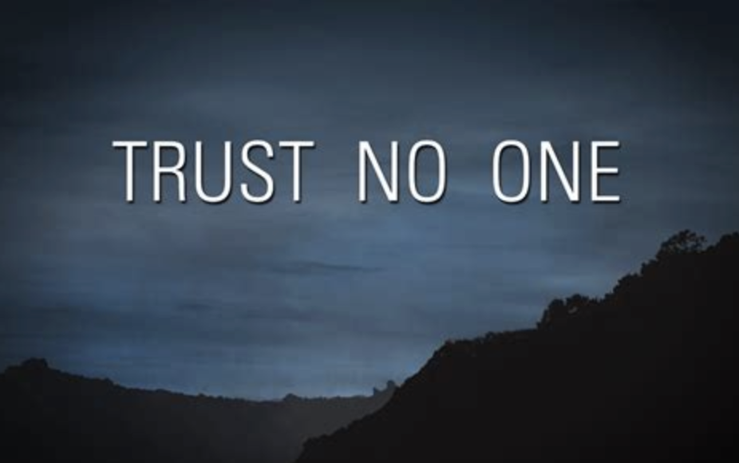

# 🌹 𝙱𝚎𝚌𝚘𝚖𝚎 𝚊 𝙷𝚞𝚖𝚊𝚗𝚒𝚜𝚝

<figure><figcaption></figcaption></figure>

## <mark style="background-color:green;">Recommended Books</mark>

* **Meditations, by Marcus Aurelius**
* **Heroism, by Emerson**
* **The Iliad and the Odyssey, by Homer**
* **Nausea, by Sartre**
* **Existentialism is a Humanism, by Sartre**
* **On the Genealogy of Morals, by Nietzsche**
* **The Denial of Death, by Becker**
* **The Book of Disquiet, by Pessoa**
* **Kafka on the Shore, by Haruki**
* **Sophie's World, by Gaarder**
* **Apology, by Plato**
* **The Republic, by Plato**
* **Brave New World, by Huxley**
* **Simulacra and Simulation, by Baudrillard**
* **Animal Farm, by Orwell**
* **On Liberty, by Stuart Mill**
* **In the Penal Colony, by Kafka**
* **The Stranger, by Camus**
* **The World as Will and Representation, by Schopenhauer**
* **Critique of Pure Reason and Critique of Practical Reason, by Kant**
* **On the Shortness of Life, by Seneca**
* **War and Peace**
* [**Rules for Radicals, by Alinsky**](https://ia801202.us.archive.org/28/items/RulesForRadicals/RulesForRadicals.pdf)
* **The Power of Now, by Tolle**
* **Anything by Spinoza**
* [**The Last, Whole Introduction to Agorism, by Konkin III**](https://theanarchistlibrary.org/library/samuel-edward-konkin-iii-the-last-whole-introduction-to-agorism)
* **Carl Young's Philosophy:** [**Collection 1** ](https://www.youtube.com/playlist?list=PL_0I7-kEnl0a-LIJt0jzonLLufyjRGje6)**and** [**Collection 2**](https://www.youtube.com/playlist?list=PLAYxecbGotUz1tjZlymlSc30aENg_S0Xp)
* **Nietzsche's Philosophy:** [**Collection 1**](https://www.youtube.com/playlist?list=PL_0I7-kEnl0Zl6FCbMY6dadEFg5iQ516w) **and** [**Collection 2**](https://www.youtube.com/playlist?list=PLAYxecbGotUyqiNRXY_VrUvF952rLmyNl)
* [**Existentialism Explained**](https://www.youtube.com/playlist?list=PL_0I7-kEnl0Y_3uTzJ-j-Hqk2Memvivkg)

<figure><figcaption></figcaption></figure>

***

## <mark style="background-color:purple;">🎖️Talented Contemporary Humanists🎖️</mark>

* [**The Free Press**](https://www.youtube.com/@thefreepress/featured)
* [**Closer to the Truth**](https://www.youtube.com/@CloserToTruthTV)
* [**Horses**](https://www.youtube.com/@HorsesOnYT)
* [**Daily Stoic**](https://www.youtube.com/@DailyStoic)
* [**Ron Paul**](https://www.youtube.com/@RonPaulLibertyReport)
* [**Dave Smith**](https://www.youtube.com/@PartOfTheProblem)
* [**Pope Leo XIV**](https://www.vatican.va/content/leo-xiv/en/apost_exhortations/documents/20251004-dilexi-te.html)
* [**Jordan Peterson**](https://www.youtube.com/@JordanBPeterson)
* [**Megyn Kelly**](https://www.youtube.com/@MegynKelly)
* [**Peter Thiel**](https://www.youtube.com/watch?v=918qslcfwfY)
* [**Joe Rogan**](https://www.youtube.com/@joerogan)
* [**Alex O'Connor**](https://www.youtube.com/watch?v=cP0S2hWaVu8)
* [**Robin Hanson**](https://www.overcomingbias.com)
* [**Astral Scott Alexander Codex**](https://www.astralcodexten.com/)
* [**Curtis Yarvin**](https://graymirror.substack.com/)
* [**Theo Von**](https://www.youtube.com/@TheoVon)
* [**Lex Fridman**](https://www.youtube.com/lexfridman)
* [**Matthew McConaughey**](https://www.youtube.com/@MatthewMcConaughey)
* [**Robert Greene**](https://www.youtube.com/@RobertGreeneOfficial)
* [**Erik Torenberg**](https://www.youtube.com/@UpstreamwithErikTorenberg)
* [**overthinker**](https://www.youtube.com/@overthinker)
* [**Eternalised**](https://www.youtube.com/@Eternalised)
* [**Bill Maher**](https://www.youtube.com/@ClubRandomPodcast)
* [**Ben Shapiro**](https://www.youtube.com/@BenShapiro)
* [**David Duchovny**](https://www.youtube.com/@FailBetterwithDavidDuchovny)
* [**David Deutsch**](https://www.youtube.com/channel/UCGQeMmshKZiA_2sjyRhSHbg)
* [**Lawrence M. Krauss**](https://www.youtube.com/@TheOriginsPodcast/videos)
* [**Jay Shetty**](https://www.youtube.com/@JayShettyPodcast.)
* [**Andrew Huberman**](https://www.youtube.com/@hubermanlab)
* [**Zohran Mamdani**](https://www.youtube.com/watch?v=iQVsVNPkPmE)
* [**Naval**](https://www.youtube.com/@NavalR)
* [**Garry Tan**](https://www.youtube.com/@GarryTan)

***

## <mark style="background-color:orange;">🎖️ Talented Classical Humanists 🎖️</mark>

* **Miró**
* **Kandinsky**
* **Magritte**
* **Mondrian**
* **Kahlo**
* **Munch**
* **Gauguin**
* **Klimt**
* **van Eyck**
* **Basquiat**
* **Rembrandt**
* **Manet**
* **Pollock**
* **Klee**
* **Bosch**
* **Monet**
* **Van Gogh**
* **Picasso**
* **Wood**

***

## <mark style="background-color:yellow;">🎖️ Talented Digital Artists Humanists 🎖️</mark>

* [**Banksy**](https://www.banksy.co.uk/)
* [**The Dor Brothers**](https://www.youtube.com/@thedorbrothers)
* [**ITS.Vermeer**](https://www.youtube.com/@ITSVermeerMusic)
* [**Jake Fried**](http://inkwood.net/)
* [**Fewocious**](https://twitter.com/fewocious)
* [**Artblocks**](https://twitter.com/artblocks_io)
* [**Beeple**](https://twitter.com/beeple)
* [**Pak**](https://twitter.com/muratpak)
* [**XCOPYART**](https://twitter.com/XCOPYART)
* [**neon\_based**](https://twitter.com/neon_based)

